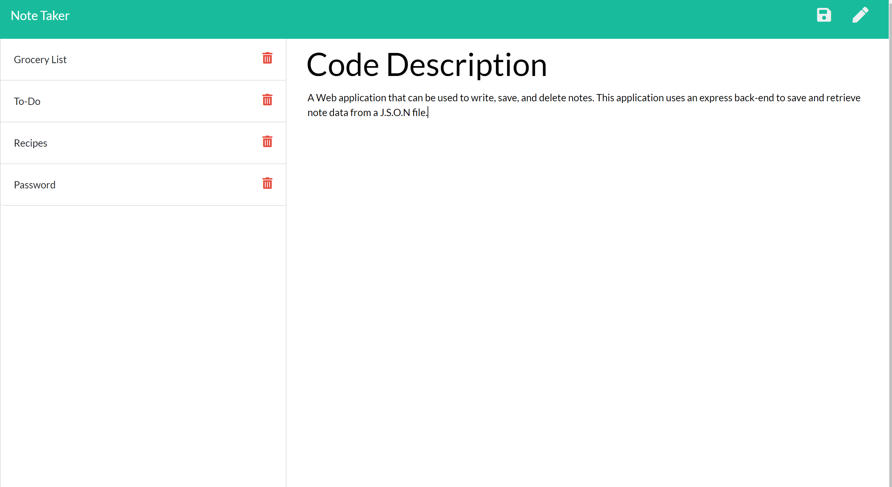

## Note Taker

DEPLOYED APLLICATION

https://louis-note-taker.herokuapp.com/

## Description

A Wev application that can be used to write, save, and delete notes. This application uses an express backend to save and retrieve note data from a JSON file.

- Node.js
- Express
- ES6
- AJAX

## User Story

AS A user, I want to be able to write and save notes

I WANT to be able to delete notes I've written before

SO THAT I can organize my thoughts and keep track of tasks I need to complete

## Business Context

For users that need to keep track of a lot of information, it's easy to forget or be unable to recall something important. Being able to take persistent notes allows users to have written information available when needed.

## Usage

- From the home page click Get Started.
- Type your Note Title and Note Text in the fields with the placeholder names.
- If title and text have content then the Save icon appears in the upper right corner.
- Click on the save icon to save your note.
- All note titles is displayed on the left.
- Select a note title on the left to display the note text.
- Use the trash icon next to the title to delete that note.
- Use the pencil icon in the top right to return to the new note screen.

# Skills Learned

- Express Routes
- C.R.U.D
- Tying the Javascript to the Node backend
- Publishing to Heroku